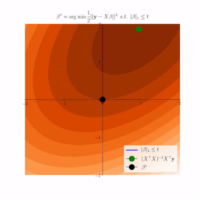
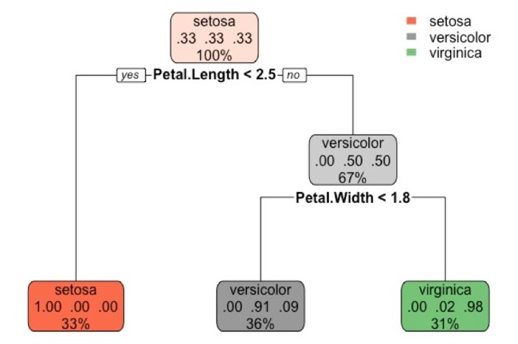

```{r setup, include=FALSE, cache=FALSE}
# Set global R options
options(htmltools.dir.version = FALSE, servr.daemon = TRUE)
# Set global knitr chunk options
knitr::opts_chunk$set(
  fig.align = "center", 
  #cache = TRUE,
  error = FALSE,
  message = FALSE, 
  warning = FALSE, 
  collapse = TRUE,
  eval = FALSE
)
library(ggplot2)
# This is good for getting the ggplot background consistent with
# the html background color
thm <- theme_bw() + 
  theme(
    panel.background = element_rect(fill = "transparent", colour = NA), 
    plot.background = element_rect(fill = "transparent", colour = NA),
    legend.position = "top",
    legend.background = element_rect(fill = "transparent", colour = NA),
    legend.key = element_rect(fill = "transparent", colour = NA)
  )
theme_set(thm)
```

class: title-slide   
<a href="https://github.com/dlab-berkeley/Machine-Learning-in-R"></a>


<br><br><br><br>
# .font130[Introduction to Machine Learning in R]

### Evan Muzzall and Chris Kennedy  
### May 10, 2019

---

class: center, middle, inverse

# "It’s tough to make predictions, especially about the future." -Yogi Berra

---

# D-Lab - IOKN2K! (It's OK Not To Know!)
[Visit the UC Berkeley D-Lab](http://dlab.berkeley.edu/) to learn more about our services, resources, and other R offerings:  

* [R Fundamentals](https://github.com/dlab-berkeley/R-Fundamentals): Introduction to data types/structures, and importing/exporting, visualizing, and testing data.  
* [Data Wrangling with R](https://github.com/dlab-berkeley/R-wrang): Focus on dplyr and tidyr packages.  
* [R graphics](https://github.com/dlab-berkeley/R-graphics): Base and ggplot2 visualizations.  
* [Introduction to Deep Learning](https://github.com/dlab-berkeley/Deep-Learning-in-R): Keras basics for artificial neural networks.  
* [Machine Learning Working Group](https://github.com/dlab-berkeley/MachineLearningWG): R and Python code for a variety of machine learning algorithms.  

---

# Resources
_An Introduction to Statistical Learning - with Applications in R (2013)_ by Gareth James, Daniela Witten, Trevor Hastie, Robert Tibshirani. Springer: New York. [Amazon](https://www.amazon.com/Introduction-Statistical-Learning-Applications-Statistics/dp/1461471370) or [free PDF](http://www-bcf.usc.edu/~gareth/ISL/). We encourage you to support the authors by purchasing their textbook!  

[Also check out the many resources](https://github.com/dlab-berkeley/MachineLearningWG) outlined in D-Lab's Machine Learning Working Group repository. 

---

# Software requirements

[Click here to install R 3.4 or greater](https://cloud.r-project.org/)   

[Click here to install RStudio (Open Source License FREE)](https://www.rstudio.com/products/rstudio/download/)  

---

# Download materials

[Click here to download the Introduction to Machine Learning in R workshop materials](https://github.com/dlab-berkeley/Machine-Learning-in-R)
  * Click green “Clone or Download” button
  * Click “Download Zip”
  * Extract this zip file to your Dropbox / Box / etc. and double-click the Rproj file.
  
Or (advanced):
  * Copy the github clone URL (https or ssh version)
  * In RStudio select File -> New Project -> Version Control -> Git and paste the repository URL

---

# Install required R packages 

This workshop will utilize a variety of packages to install and organize the code, fit the machine learning algorithms, visualize their outputs, and evaluate their performances. 

* Algorithms: "glmnet", "ranger", "rpart", "xgboost"  

* Visualization: "ggplot2", "rpart.plot", "vip"  

* Machine learning frameworks: "caret", "SuperLearner"  

* R utility packages: "remotes", "magrittr", "dplyr"  

* Miscellaneous: "pROC", "rio"  

* Chris Kennedy's R Toolkit: "ck37r"

### Highlight and run lines 12-26 inside 1-overview.Rmd to install these packages. Then, highlight and run lines 30-46 to import them. 

---

# Machine learning defined

Machine learning evolved from scientific pursuits in statistics, computer science, information theory, artificial intelligence, and pattern recognition.  

How to define machine learning?  
1) **Generally:** algorithms, computers, and other machines that can "learn" without direct input from a human programmer.  
2) **Practically:** sets of tools for investigating/modeling/understanding data.  
3)  **Specifically:** (see below)

---

# Brief history of machine learning

A proto-example:  
- [Pascal's calculator](http://history-computer.com/MechanicalCalculators/Pioneers/Pascal.html)  

20th Century advances:   
- [McCulloch Pitts neuron model](http://wwwold.ece.utep.edu/research/webfuzzy/docs/kk-thesis/kk-thesis-html/node12.html)  
- [Turing test](http://www.jstor.org/stable/pdf/2251299.pdf)  
- [Rosenblatt's perceptron](http://www.ling.upenn.edu/courses/cogs501/Rosenblatt1958.pdf)  
- [Samuel and the game of checkers](https://ieeexplore.ieee.org/search/searchresult.jsp?searchWithin=%22Publication%20Number%22:5288520&searchWithin=%22Volume%22:3&searchWithin=%22Issue%22:3&searchWithin=%22Start%20Page%22:210)  

Modern topics:  
- [Turing Test: 50 years later](http://www.cs.bilkent.edu.tr/~akman/jour-papers/mam/mam2000.pdf)  
- [Computer vision](http://www.sciencedirect.com/science/article/pii/S1071581916301264)  
- [Data cleaning](http://www.betterevaluation.org/sites/default/files/data_cleaning.pdf)  
- [Robotics](https://arxiv.org/abs/1708.04677)  
- [Cloud computing](https://arxiv.org/abs/1707.07452)  

---

# Brief history of machine learning

The importance of statistics:  
- [Welling's commentary](https://www.ics.uci.edu/~welling/publications/papers/WhyMLneedsStatistics.pdf)  
- [Srivastava's discussion](https://www.analyticsvidhya.com/blog/2015/07/difference-machine-learning-statistical-modeling/)  
- [Breiman's take](https://projecteuclid.org/euclid.ss/1009213726)  

Seek "actionable insight":  
- [Actionable insight](https://www.techopedia.com/definition/31721/actionable-insight)  

---

# Supervised machine learning

Selecting a machine learning algorithm depends on the characteristics of the problem being investigated - there is no "best" method applicable to all cases. Machine learning is generally divided into three broad classes of learning: [supervised](https://en.wikipedia.org/wiki/Supervised_learning), [unsupervised](https://en.wikipedia.org/wiki/Unsupervised_learning), and [reinforcement](https://en.wikipedia.org/wiki/Reinforcement_learning).  

We will focus on **supervised learning** and will begin with Ordinary Least Squares (OLS) and Lasso regression, followed by tree-based and ensemble classification methods. 

The syntax for supervised machine learning algorithms can be thought of like this:  

$y$ ~ $x_{1}$ + $x_{2}$ + $x_{3}$… $x_{n}$

$y$ is the dependent/response/target/outcome variable  
$x$ are the independent/input/predictor/feature/covariate variables  

Supervised machine learning methods learn a target function $f$ that best maps $x$ to $y$ based on a set of [training data](https://en.wikipedia.org/wiki/Training,_validation,_and_test_sets#Training_dataset). 

---

# Supervised machine learning

Our function would look like this: $y = f(x) + \epsilon$ where $f$ is some function that relates our $x$ predictor variables to $y$ in an unknown way thus we must estimate it. Epsilon $\epsilon$ is the random error, is independent of $x$ and averages to zero. Therefore, we can predict $y$ using $\hat{y} = \hat{f}(x)$ for new data (the [test dataset](https://en.wikipedia.org/wiki/Training,_validation,_and_test_sets#Test_dataset)) and evaluate how well the algorithm learned the target function when introduced to new data.  

**How to define machine learning, specifically? (revisited)**  
More specifically, we can think of machine learning as a bunch of methods to estimate $f$!  

---

# Classification or regression?

**Classification** is used when the $y$ outcome variable is categorical/discrete. Binary examples generally refer to a yes/no situation where a 1 is prediction of the "yes" category and 0 as the "no". Classification models the probability that the outcome variable is 1 based on the covariates: $Pr(y = 1 | x)$. This can be extended to multi-level classification as well.  

**Regression** is used when the target $y$ outcome variable is continuous. Regression models the conditional expectation (conditional mean) of the outcome variable given the covariates: $E(y | x)$.  

---

# Data preprocessing

A longstanding first step is to split a dataset into **"training"** and **"test"** subsets. A training sample usually consists of a majority of the original dataset so that an algorithm can learn the model. The remaining portion of the dataset is designated to the test sample to evaluate model performance on data the model has not yet seen. **Clean, subset, and handle missing data if necessary** before the splitting process commences.  

---

# Model performance

**Performance metrics** are used to see how well a model predicts a specified outcome on training and test datasets.  

A model that performs poorly on the training dataset is **underfit** because it is not able to discern relationships between the $x$ and $y$ variables.  

A model that performs well on the training dataset but poorly on the test dataset is said to be **overfit** because the model performed worse than expected when given new data. To some extent the patterns found in the training data may have been random noise and therefore, by random chance, are different in the test data.  

**Common performance metrics**: Accuracy, Mean squared error, Sensitivity and specificity, Area under the ROC curve (AUC)  

---

class: left

# Workshop goals

### 1) Learn the basics of using six machine learning algorithms in R:  

- OLS regression  
- Lasso  
- Decision tree  
- Random forest  
- Boosting  
- SuperLearner  
  
### 2) Vizualize important information:  
- Lasso coefficient paths  
- Decision trees  
- Random forest variable importance  
- AUC from different boosting models  
- SuperLearner cross-validated risk   

---

# Workshop goals

### 3) Examine the performance of these models  
* (Root) mean-squared error, lasso penalization coefficient  
* Mean decrease accuracy
* Accuracy
* AUC
* Cross-validated risk

### 4) Simultaneously compare multiple algorithms in an ensemble  
* Compare various tunings of multiple algorithms at once
* Weighted ensemble average
* Discrete winner

---

# Specific workshop goals - heart disease dataset  

[Use the  heart disease dataset](https://archive.ics.uci.edu/ml/datasets/heart+Disease) to investigate the following questions:  

1) **OLS and lasso regression examples:** How well can a person's age be predicted using the other heart disease-related variables?  

2) **Binary classification examples:** How reliably can different algorithms predict a person's heart disease status using the other variables?  

---

# Data preprocessing

A first task will be to split our data into training and test sets. This not only allows us to build a model on training data and evaluate its performance on test/holdout data, but it is also a good way to get familiar with cross-validation. 

The short version is that we need to:  
1. Define $y$ outcome and $x$ predictor variables  
2. Remove $y$ variable from $x$ predictor datasets  
3. Handle missing data (if present)  
4. Scale data (if necessary)  
5. Convert factors to indicators (if necessary)  
6. Define training and test datasets  

### Open "2-preprocessing.Rmd" to get started with the data.  

---

# Cross-validation

[Cross-validation](https://en.wikipedia.org/wiki/Cross-validation_(statistics%29) is a way to measure model performance of an entire dataset by repeating the splitting process _k_ number of times then combining/averaging performance across all iterations. 

.center[]

---

# Algorithms

What is a machine learning [algorithm](https://en.wikipedia.org/wiki/Outline_of_machine_learning#Machine_learning_algorithms)?

.center[]

.center[[Read Texas Am GIF by Texas A&M University](https://giphy.com/gifs/tamu-dog-page-3LrK7Q7UhF5MnhZ5ja)]

Sounds difficult! Instead, scroll down a bit further to read about machine learning [methods](https://en.wikipedia.org/wiki/Outline_of_machine_learning#Machine_learning_methods) section and get a handle on topics covered in this workshop.   

---

# What is regression? 

Regression analysis is a technique to infer the relationship between a $y$ outcome variable and $x$ predictor variable(s) and how much $y$ changes when $x$ is altered. 

This algorithm ["regresses"](https://stats.stackexchange.com/questions/207425/why-do-we-say-the-outcome-variable-is-regressed-on-the-predictors/207621) $y$ onto $x$. In simpler terminology we want to see how our $x$ variables can be used to predict $y$ for this example. 

Regression allows us to ask useful questions of our data, such as: 
1. Is there a relationship between $y$ and $x$? 
2. How strong are these relationships? 
3. How can $y$ be predicted for certain values of $x$? 
4. How well can the model be used to predict $y$ when new data are used? 

Simple (one $y$ and one $x$ variable) linear (relationship between parameters being estimated) regression can be thought of as the simplest form of supervised machine learning and can be used for both prediction and inference. 

---

# Regression syntax

The syntax for simple regression looks like this: $Y = β0 + β1x + ε$ 

$y$ = dependent/response/target/outcome variable  
$x$ = independent/input/predictor/feature/covariate variables  
$β0$ = intercept  
$β1x$ = slope for that particular feature  
epsilon  ${\epsilon}$ = error  

Remember that in multivariate regression, there is more than one $x$ variable. 

---

# Ordinary least squares example

[Ordinary least squares (OLS)](https://en.wikipedia.org/wiki/Ordinary_least_squares) regression is the simplest use case when the target $y$ variable is continuous. OLS computes a best fit line that minimizes the vertical squared and summed distances from each point to calculate the model's goodness of fit. This workshop's example will predict age from the [heart disesase dataset](https://archive.ics.uci.edu/ml/datasets/heart+Disease) using the other variables as predictors.  

[Mean squared error (MSE) and root mean squared error (RMSE)](https://en.wikipedia.org/wiki/Mean_squared_error) are quick ways to evaluate performance. MSE measures the difference between observed and expected values, with smaller values indicative of greater predictive accuracy. The advantage of RMSE is that it can be easier to interpret and explain because it is on the same unit scale as the outcome variable we are predicting. 

Remember that under the hood, [`lm`](https://www.rdocumentation.org/packages/stats/versions/3.5.2/topics/lm) is one-hot encoding factors to indicators, but [`model.matrix`](https://www.rdocumentation.org/packages/stats/versions/3.5.2/topics/model.matrix) was already manually used to do so.  

Also be sure to [check out this blog post](http://blog.yhat.com/posts/r-lm-summary.html) on how to fit and interpret linear models. 

---

# Lasso

[Lasso (least absolute shrinkage and selection operator)](https://en.wikipedia.org/wiki/Lasso_(statistics%29) is a form of variable selection regression that applies penalization to the coefficients through sparsity. It shrinks coefficients of the features that are not related to the outcome variable to zero, thus removing them to provide an ostensibly simpler model for interpretation.  

Sparsity: "Loosely speaking, a sparse statistical model is one in which only a relatively small number of parameters (or predictors) play an important role." (Hastie et al. 2016:1) aka a subset of the original variables. 

---

# Lasso

Lambda $\lambda$ is the regularization coefficient, or the degree to which the beta coefficients should be penalized.  

When $\lambda$ is zero, ordinary least squares regression is performed. 

Alpha $\alpha$ determines the type of model; 1 indicates lasso penalty, 0 indicates ridge penalty, and anything inbetween indicates elastic net.  

Be sure to [read the glmnet vignette](https://web.stanford.edu/~hastie/Papers/Glmnet_Vignette.pdf).  

### Open "3-lasso.Rmd" to work through the regression examples. 

---

# Lasso

"Illustration of the Lasso and its path in 2D: for t small enough, the solution is sparse!" - Pierre Ablin

.center[]

source: https://twitter.com/PierreAblin/status/1107625298936451073

---

# Decision trees

Decision trees are a standard alternative to linear regression and make no assumptions about the data; they split the data into smaller and smaller subgrioups of $x$ covariates in terms of $y$ and split on each predictor. How does it work? 

A decision tree predicts that an observation belongs to its correct class. 

For basic classification, we are no longer using MSE or RMSE but instead classification error rate. 

To determine the top split ("root node"), the model looks at all cutpoints to see which group stands out as the best split. The "complexity parameter" can be used to [prune](https://en.wikipedia.org/wiki/Decision_tree_pruning) the tree to a lesser number of splits and removes unnecessary information. 

---

# Decision trees

.center[]

### Open "4-decision-trees.Rmd" to work through the decision tree examples. 

